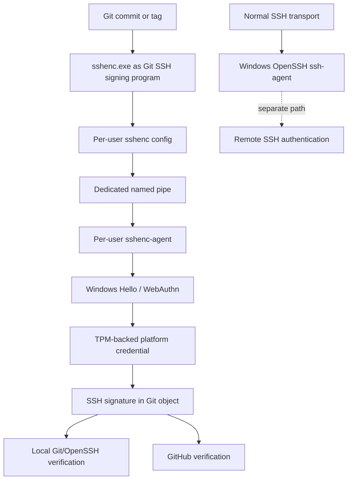

# Architecture

## 1. Scope

`hello-approval` is a Windows-focused reference architecture for hardware-backed **human signing and approval**.

The project is intentionally centered on one primitive:

> A specific human-visible statement is signed by a hardware-backed credential after interactive Windows Hello / WebAuthn user verification, and a separate verifier later evaluates that signature under an explicit policy.

Git signing is the first production-tested integration.

## 2. Logical model

The architecture separates six concepts:

### Credential

A Windows Hello / WebAuthn platform credential backed by the local platform authenticator and, where supported/configured, TPM-protected key material.

### Signer

The local component that can request use of the credential. In the first integration this is `sshenc-agent` reached through an isolated named pipe.

### Policy

Rules constraining which credential may be used, which label is exposed, which purpose is accepted, and which verifier trusts which principal.

### Subject

The exact object being signed: for v0.1, a Git commit or tag through Git's SSH-signing flow.

Future integrations may use a canonical structured approval envelope rather than a raw digest alone.

### Attestation

The signed result plus enough context to preserve the meaning of the signature.

### Verifier

A component that verifies cryptographic validity and applies trust/policy. Examples include local OpenSSH/Git verification, GitHub, CI/CD, or a future deployment controller.

## 3. Production-tested Git path



The two agent paths are deliberately independent.

## 4. Identity separation

The architecture distinguishes:

- **author identity** — who authored the Git commit (`user.name`, `user.email`);
- **signing credential** — which device-bound credential signed it;
- **trust policy** — which principal/key a verifier accepts for a purpose.

A recommended Git pattern is repo-local author identity with machine-level signing configuration. That pattern is optional, but the concepts must remain separate.

## 5. Agent isolation

The reference integration must not:

- run `sshenc install`;
- stop or disable the stock Windows OpenSSH Authentication Agent;
- overwrite persistent `SSH_AUTH_SOCK` as a production mechanism;
- modify `GIT_SSH_COMMAND`;
- expose unrelated authentication credentials through the signing agent.

Instead, `sshenc-agent` uses:

- a dedicated named pipe;
- an allow-listed signing label;
- per-user configuration;
- an interactive per-user Scheduled Task.

On Windows, the `SSH_AUTH_SOCK` guardrail is still intentional even though the value names a Windows pipe rather than a Unix-domain socket. Upstream `sshenc install` writes persistent user environment integration, while `sshenc`'s own client can address its configured agent channel directly. `hello-approval` therefore does not need to repoint unrelated SSH consumers globally.

### Upstream packaging boundary

The upstream Windows installer is not an inert file-copy mechanism. For the audited v0.6.101 tag (`2b689c8644d0590e80f1839721dec53b95f44526`), `installer/sshenc.wxs` wires `sshenc.exe install` as a deferred custom action after installing files and wires `sshenc.exe uninstall` as a deferred custom action before removal. The corresponding Windows integration code can stop/disable the stock `ssh-agent` service and set persistent user `SSH_AUTH_SOCK` and `GIT_SSH_COMMAND` values.

Those side effects violate this project's isolation invariants. Until upstream provides an installer mode whose behavior is proven compatible, v0.1 must use a pinned ZIP/manual-binary placement path with checksum verification and must not run `sshenc install` or `sshenc uninstall`. WinGet is also unsuitable when its manifest resolves to that MSI.

The upstream `gitenc.exe` integration is also outside the v0.1 boundary. At v0.6.101, `gitenc --config` writes `core.sshCommand` in addition to signing configuration, and normal `gitenc` operation is designed to wrap Git transport as well as signing. `hello-approval` deliberately configures Git signing directly and leaves ordinary SSH transport independent.

In v0.1, upstream integration commands (`sshenc install`, `sshenc uninstall`, and `gitenc`) are therefore out of scope. Only the minimal signer/agent binary surface required by the reference integration is used.

This packaging decision is about avoiding unwanted integration mutations; it does not make the ZIP intrinsically trustworthy.

## 6. Interactive-session requirement

Windows Hello prompts belong to the logged-in user's interactive desktop. Therefore the signing agent is deliberately **not** modeled as a SYSTEM service or non-interactive background service.

The Scheduled Task must run in the intended user's interactive session, with limited privileges unless a future operation proves elevation is necessary.

## 7. No-visible-console requirement

`sshenc-agent` is currently a Windows console-subsystem executable. Running it directly as a long-lived interactive Scheduled Task can therefore leave a persistent terminal/conhost window visible on the desktop.

That is unacceptable for the reference implementation.

The v0.1 launcher design must satisfy all of the following:

1. the agent remains in the interactive user's session;
2. Windows Hello UI remains available;
3. no persistent console window is visible;
4. Task Scheduler retains meaningful lifecycle supervision;
5. exit status and unexpected agent termination remain observable;
6. restart policy still works;
7. stdout/stderr are redirected to controlled log files or another explicit sink;
8. no SYSTEM/service-account workaround is used merely to hide the window.

HA-1.2 selected a hidden Windows PowerShell wrapper that remains alive and supervises `sshenc-agent.exe` through documented Win32 primitives. The wrapper creates the child with `CREATE_NO_WINDOW`, atomically assigns it to a Job Object with `PROC_THREAD_ATTRIBUTE_JOB_LIST`, restricts inherited handles, waits for the child, and relies on `JOB_OBJECT_LIMIT_KILL_ON_JOB_CLOSE` so abrupt wrapper termination cannot leave an orphaned agent. The design and production acceptance are documented in [Invisible interactive agent launcher](LAUNCHER.md).

HA-1.3 binds that wrapper to an interactive, limited-privilege, per-user Scheduled Task with a user-logon trigger. Task installation/update/uninstall semantics are documented in [Scheduled Task installation](SCHEDULED-TASK.md).

## 8. Generic approval model

Future non-Git integrations must not treat a bare signature over an arbitrary digest as sufficient authorization.

An approval should bind the signature to a canonical, versioned, domain-separated statement, conceptually:

```yaml
schema: hello-approval/v1
purpose: terraform-apply
action: apply
target: production
subject:
  algorithm: sha256
  digest: "..."
expires_at: "..."
nonce: "..."
```

The exact format is deliberately deferred. The security requirement is not.

This prevents a valid signature created for one purpose from being replayed as approval for a different purpose.

## 9. Git v0.1 configuration boundary

The first integration configures Git signing only:

```text
gpg.format = ssh
gpg.ssh.program = <path-to-sshenc.exe>
user.signingkey = <path-to-public-key>
commit.gpgsign = true
tag.gpgsign = true
```

Local verification additionally uses an `allowed_signers` file.

The reference implementation does not configure ordinary SSH transport credentials.

## 10. Automation boundary

Safe to automate after state checks:

- directory/layout creation;
- config rendering with backup/explicit overwrite rules;
- Scheduled Task creation/update;
- Git signing configuration;
- local verification setup;
- diagnostics and acceptance checks;
- checksum verification of pinned downloads;
- inert/manual placement of already-verified binaries.

Keep explicit/manual or confirmation-gated:

- platform credential creation;
- destructive credential deletion;
- GitHub signing-key registration/removal where API automation would expand permissions or obscure user intent;
- any operation that overwrites an existing user configuration;
- enabling account-wide policy such as GitHub Vigilant Mode.

## 11. v0.1 invariants

A v0.1 implementation is not acceptable unless:

- stock `ssh-agent` behavior is unchanged;
- the signing private key is not materialized as a normal private-key file;
- only the intended signing label is exposed;
- Git can sign commits/tags through the isolated path;
- local verification succeeds;
- GitHub verification can be independently confirmed;
- the agent survives logon/startup as intended;
- the agent produces no persistent visible terminal window;
- uninstall/rollback is conservative.
